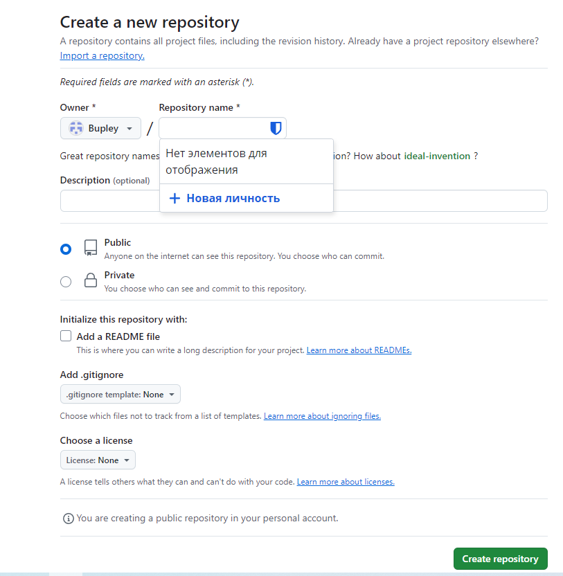
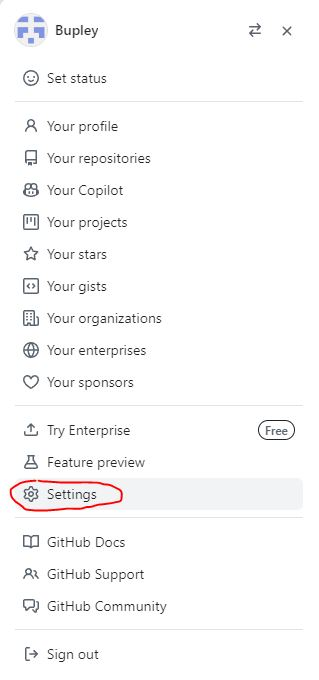
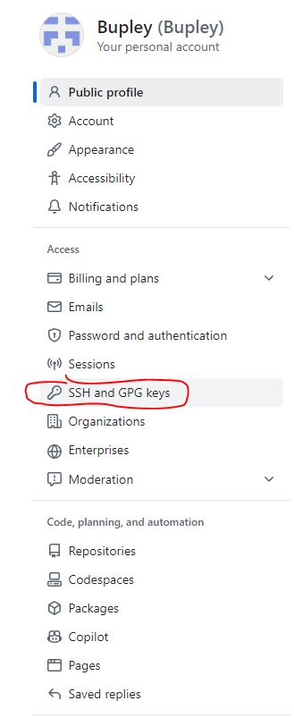
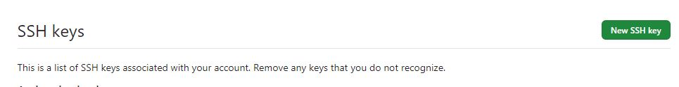
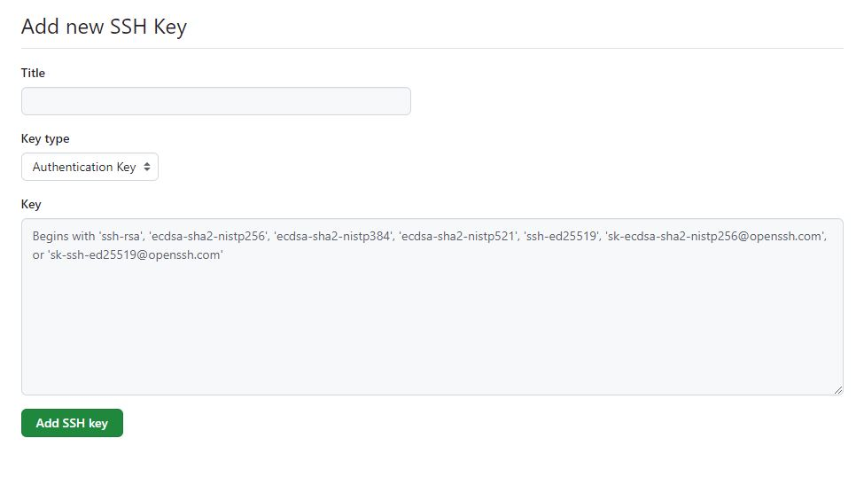
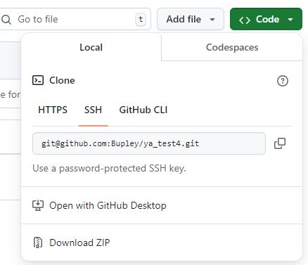

# Работа с командной строкой
## Подготовка
Скачать и установить  GitBash по [ссылке](https://git-scm.com/downloads)
## Основные команды
### Команды навигации по папкам

* `pwd` - показвает текущее положение
* `ls`  - показывает папки и файлы, вложенные в текущую директорию
* `ls -a`  - показывает в том числе скрытые файлы и папки, а так же те, что начинаются с символа `.` (например, `.git`)
* `cd folder_name` - переместиться во вложенную папку с названием `folder_name`
* `cd ~` - переместиться в домашнюю папку 
* `cd ..` - переместиться на ступень выше, в родительнскую папку
* `cd /` - переместиться в коренную папку 
### Работа с файлами и папками
* `touch file.txt` - создание файла `file` с расширением `.txt`
* `mkdir folder_name` - создание папки `folder_name`

Можно создавать несколько файлов, просто перечисляя их после `touch`

Можно создавать одновоременно вложенную папку и файл в ней, разделяя символом `/`

* `cp file.txt ~/folder_name` - скопировать файл `file.txt` в папку `folder_name`
* `mv file.txt ~/folder_name` - переместить файл `file.txt` в папку `folder_name`
* `cat file.txt` - распечатать файл `file.txt`
* `rm file.txt`  - удалить файл `file.txt`
* `rmdir folder_name` - удалить папку `folder_name`, если она пустая
* `rm -r folder_name` - удалить папку `folder_name` и все что в ней вложено

## Создание локального репозитория (на ПК)
1. `git init`  - в выбранной директории создает репозиторий. В таком случае, в конце пути текущего положения появлется `(master)` или `(main)`. В папке появится скрытая папка `.git`. Чтобы убрать статус репозитория, нужно ввести `rm -rf .git`.
2. Проверка текущего состояния репозитория вызывается командой `git status`. Если в проводнике туда что то положили или как-то исправили вложенные туда файлы, они подсветятся красным в результате обработки команды.
3. Эти файлы нужно подготовить к отправке в репозиторий с помощью команды `git add .` - это своеобразное предупреждение системы, что ты будешь добавлять эти файлы в репозиторий.
4. Чтобы непосредственно загрузить в репозиторий изменения, нужно выполнить команду `git commit -m "comment"` - в поле `comment` лучше дать подробное описание, что изменилось и где.

## Создание удаленного репозитория на GitHub


Выпадает такое окошко


Задаем название репозитория, и нажимаем *create repository*.

**Важно** в удаленном репозитории не создавать никаких вложенных файлов.

## SSH-ключ
1. Перейти в домашнюю диркеторию, убедиться, что нет уже созданных SSH-ключей:
```
cd ~
ls -la .ssh/
```
В результате получили список созданных ключей (или их отсутствие).

2. Сгенерировать SSH-ключ:

`ssh-keygen -t ed25519 -C "электорнная почта, привянанная к учетке на GitHub`

Результат:
`Generating public/private rsa key pair`

3. Указать, куда положить ключ: нажать Enter, и он сохраниться в домашней папке (та что вызывается `cd ~`)

4. Задать кодовую фразу. Если лень, нажат дважды Enter - тогда кодовой фразы не будет.

5. Скопировать содержимое публичного ключа в буфер обмена: 

`clip < ~/.ssh/id_ed25519.pub `

6. Profile -> Settings -> SSh and GPG keys -> New SSH key




Задать название ключа, тип оставляем **Autentification type**, в поле **Key** вставляем из буфера обмена то, что скопировали ранее.
7. Правильность ввода ключа проверяется командой:

`ssh -T git@github.com`

В первый раз ругнется что источник не надежен, набрать *yes*, потом выдаст уведомление, что все хорошо.

## Первая синхронизация репозиториев
1. На странице репозитария скопировать и вставить URL


Выполнить следующие команды:
```
git remote add origin git@github.com:username/repo_name.git
git branch -M main
git push -u origin main
```
Где `git@github.com:username/repo_name.git` - это URL, скопированный в предыдущем шаге.

Чтобы уюедиться в связанности репозиториев, можно выолпнить команду `git remote -v` - выпадет две строчки, где первое слово - *origin* - это название главного удаленного репозитория

## Синхронизация репозитариев
Выполняется в 4 команды:
1. `git status`
2. `git add .`
3. `git commit -m 'comment'`
4. `git push`

# Лог коммита
Вызывется командой `git log`. Врезультате выпадает описание, состоящее из следующих строк:
1) хеш - буквенно-цифровой набор символов для шифрования коммитов. Через хеш можно узнать о коммите:
- автор коммита
- дата коммита
- содержание изменений, записанных с коммитом
2) Author - имя и e-mail автора
3) Date - время и дата создания коммита
4) Сообщение, выводимое в конце коммита после -m

Можно получить сокращенный лог командой `git log --oneline`.  
В логе можно отследить последний коммит - у него после хеша стоит слово HEAD

# Статусы файлов
Фалы меняют свой статус под действием изменений/обавлений фалов, команд git add и git commit. Если файл добавлен в хранилище, до команды git add он будет считаться Untracked. Если файл изменен в хранилище, то до команды git add но будет считаться modified.После git add фал переходит в остояние staged + tracked, после git commit остается только в статусе tracked

```mermaid
graph LR
%% Для нового файла в хранилище:
untracked --"git add" --> staged tracked --"git commit"--> tracked

%% Для измененного файла в хранилище:
modified tracked --"git add" --> staged tracked --"git commit"--> tracked
```

# Сообщения к коммитам
Требования:
1) Короткое (не более 72 символов)
2) Информативое
3) Написанное в одном стиле с предыдущими коммитами 